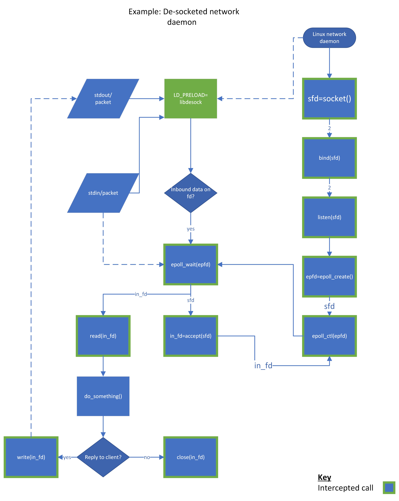

# De-socketing for Fuzzing

When fuzzing network applications the fuzzers provide their inputs over stdin
although the applications expect their input over network connections.
This library redirects all network communication to stdin and stdout such that 
network applications can be traditionally fuzzed with AFL++.

This has the advantage of
1. Improving performance by reducing kernel interactions because libdesock operates 100% in user-space 
2. Reducing the amount of manual effort necessary to create a harness

For an in-depth explanation of de-socketing see our [blog post](https://lolcads.github.io/posts/2022/02/libdesock/).

## Caveat
This version has been modified to fit a specific need to have desocking capabilites on user selected socket attributes like domain type, and port number. 
This code needs unittests and to be merged back to original project.
## Building
Libdesock uses `meson` and `ninja` as its build system.

```sh
meson setup ./build
cd ./build
```

You can configure the build using
```sh
meson configure -D <optname>=<optvalue>
```

You can get an overview over all options with
```sh
meson configure
```

The following options are specific to libdesock:

| Option          | Description                                                                                | Default |
|-----------------|--------------------------------------------------------------------------------------------|---------|
| `arch`          | The CPU architecture for which you are compiling libdesock.so                              | x86_64  |
| `debug_desock`  | If this is true, calls to functions in libdesock.so get logged to stderr.                  | false   |
| `desock_client` | If this is true, calls to `connect()` get hooked. This enables the desocketing of clients. | false   |
| `desock_server` | If this is true, calls to `bind()` get hooked. This enables the desocketing of servers.    | true    |
| `fd_table_size` | Only fds < `fd_table_size` can be desocked.                                                | 128     |
| `interpreter`   | Path to ld.so (will be determined dynamically if not set)                                  |         |

If configuration is done compile with
```sh
cd <project root>
meson compile
cd build
ninja
```

This creates a shared library `./build/libdesock.so` and a static library `./build/libdesock.a`.

## Usage
*Required  
Prepend
```sh
LD_PRELOAD=libdesock.so
```
to the invocation of any network application or
set the environment variable
```sh
AFL_PRELOAD=libdesock.so
```
when using AFL++.  

The target process may have several listening ports. Specify the individual server port to desock and ignore the rest.
Specify the interest port using the environment variable 
```sh
export DESOCK_PORT_LOCAL=666
```
Specify the client's socket port number using the environment variable 
```sh
export DESOCK_PORT_REMOTE=4444
```
Specify the v4 IP address to be associated with the server's socket.
```sh
export DESOCK_LOCALIPV4=1.1.1.4 
```
Specify the v4 IP address to be associated with the client's socket.
```sh
export DESOCK_REMOTEIPV4=1.1.2.2
```
Example test run
```sh
echo -e 'MYFUZZEDDATA' | DESOCK_PORT_REMOTE=4444 DESOCK_PORT_LOCAL=666 DESOCK_LOCALIPV4=1.1.1.4 DESOCK_REMOTEIPV4=1.1.2.2 LD_PRELOAD=libdesock.so ./test-server 666
```

## Examples
If you are using libdesock and AFL for fuzzing, the programs under test
usually require a special setup to work with AFL. Checkout our [examples](./examples) 
directory for some examples on how to properly setup network applications for fuzzing.

## Overview DFD


## Known Bugs
- TCP servers using [libuv](https://libuv.org/) cannot be de-socket-ed (yet). De-socketing of libuv currently only works with UDP servers. It only takes a small change to fix this though, if anyone needs this create an issue.
- `ioctl()` is not supported. Make sure your target does not rely on `ioctl` requests

## Copyright Notice
Libdesock is based upon [musl libc](https://musl.libc.org/) and parts of the musl source code
can be found in libdesock.
